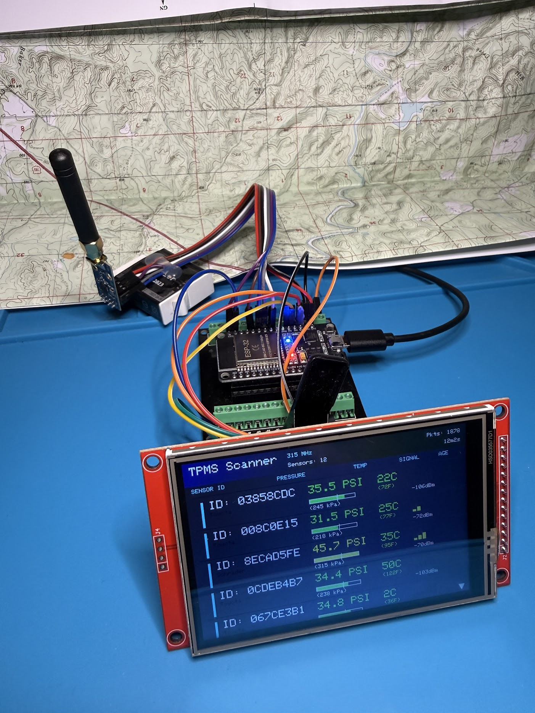
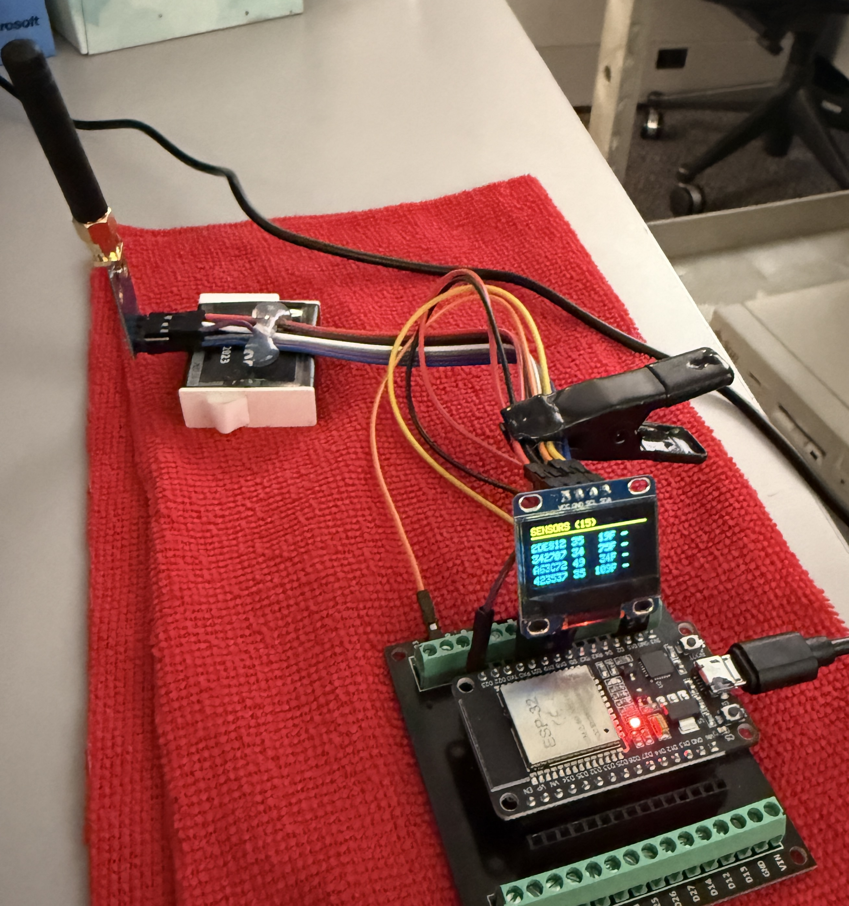
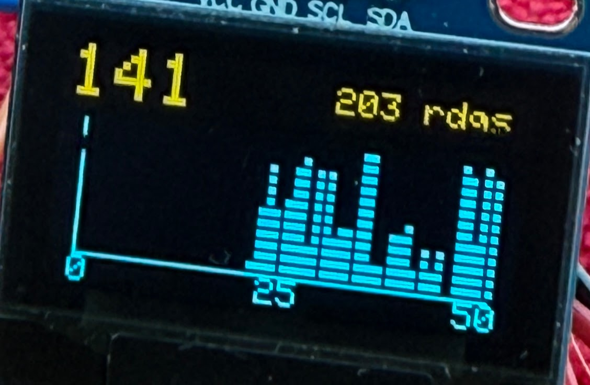

# TPMS Scanner

**See the invisible RF aura of traffic around you.**

A passive 315 MHz receiver that detects tire pressure sensor broadcasts from passing vehicles and visualizes them in real-time. Watch tire pressures stack up on a scatter plot as cars drive by during your morning commute!


*Updated build with 3.5" color TFT display (480x320)*


*Original build with 0.96" OLED display*

## What is this?

Every vehicle on the road (in North America) has four tiny radio transmitters in its tires. These **TPMS sensors** broadcast tire pressure and temperature data every 30-60 seconds on 315 MHz. This project captures those invisible signals and turns them into a visual display.

**This is a passive receiver only** - it does not transmit anything or interfere with vehicles.

## Real World Results

Here's what a 20-minute morning commute looks like - 141 unique tire sensors detected from passing traffic:



The scatter plot shows tire pressure distribution (20-60 PSI). Notice the two peaks:
- **~32-36 PSI** - Passenger cars (properly inflated)
- **~42-48 PSI** - Trucks and SUVs (higher pressure)

## Features

- **315 MHz TPMS Reception** - North American frequency (USA, Canada, Mexico)
- **Multi-Protocol Decoding** - Toyota, Schrader, and generic sensors
- **3 Display Modes** - Press BOOT button to cycle:
  - **Mode 1**: Scatter plot (PSI distribution histogram)
  - **Mode 2**: Sensor list (ID, pressure, temp, signal strength)
  - **Mode 3**: Statistics (uptime, packet counts, RSSI)
- **Real-Time Visualization** - 200ms display refresh
- **Tracks 20+ Sensors** - With automatic timeout for stale readings
- **Histogram Decay** - Bars very slowly shrink over time (3% every 5 min) to prevent maxing out during long runs, while keeping a "ghost" of past readings

## Hardware

### Option 1: 3.5" TFT Display (Recommended)

| Component | Description | ~Cost |
|-----------|-------------|-------|
| ESP32 DevKit | 30-pin development board | $8 |
| CC1101 Module | 315 MHz RF transceiver + antenna | $5 |
| 3.5" TFT LCD | ILI9488 480x320 SPI display | $12 |
| Jumper Wires | For connections | $2 |

**Total: ~$27**

### Option 2: 0.96" OLED Display (Compact)

| Component | Description | ~Cost |
|-----------|-------------|-------|
| ESP32 DevKit | 30-pin development board | $8 |
| CC1101 Module | 315 MHz RF transceiver + antenna | $5 |
| 0.96" OLED | SSD1306 128x64 I2C display | $4 |
| Jumper Wires | For connections | $2 |

**Total: ~$19**

### Wiring

**CC1101 Radio Module (both options):**
```
CC1101          ESP32
───────────────────────
GND      →      GND
VCC      →      3V3 (NOT 5V!)
GDO0     →      GPIO 21
CSN      →      GPIO 5
SCK      →      GPIO 18
MOSI     →      GPIO 23
MISO     →      GPIO 19
```

**3.5" TFT Display (HSPI):**
```
TFT             ESP32           Wire Color
─────────────────────────────────────────
VCC      →      3V3             Red
GND      →      GND             Black
SCLK     →      GPIO 14         Green
MISO     →      GPIO 12         Purple
MOSI     →      GPIO 13         White
CS       →      GPIO 15         Red
DC       →      GPIO 2          Yellow
RST      →      GPIO 4          Orange
LED/BL   →      GPIO 22         Blue
```

**0.96" OLED Display (I2C):**
```
OLED            ESP32
───────────────────────
VCC      →      3V3
GND      →      GND
SDA      →      GPIO 4
SCL      →      GPIO 22
```

*Note: TFT uses HSPI (separate from CC1101's VSPI) so both can operate simultaneously.*

## Quick Start

1. **Clone and enter directory**
   ```bash
   git clone <repo-url>
   cd tpm-scanner
   ```

2. **Install Arduino libraries**
   ```bash
   ./deploy.sh libs
   ```

3. **Compile and upload**
   ```bash
   ./deploy.sh
   ```

4. **Monitor serial output** (optional)
   ```bash
   ./deploy.sh monitor
   ```

5. **Go near some cars!** - TPMS sensors transmit every 30-60 seconds when stationary, more frequently when driving.

## Display Modes

Press the **BOOT button** (GPIO 0) to cycle through modes:

### Mode 1: Scatter Plot
```
┌────────────────────────────────┐
│ 141                       203  │  ← Unique sensors / Total readings
├────────────────────────────────┤
│ │        ▪▪▪▪▪▪                │
│ │       ▪▪▪▪▪▪▪▪               │  ← PSI distribution
│ ├──────────────────────────────│
│ 20         40         60       │
└────────────────────────────────┘
```

### Mode 2: Sensor List
```
┌────────────────────────────────┐
│ SENSORS (4)                    │
│────────────────────────────────│
│ 9421A5  33  75F  +++  *        │  ← ID, PSI, Temp, Signal, New
│ 8B3C22  35  68F  ++            │
│ 1F7E91  31  72F  ++            │
└────────────────────────────────┘
```

### Mode 3: Statistics
```
┌────────────────────────────────┐
│      STATISTICS                │
│────────────────────────────────│
│ Uptime: 23m45s                 │
│ Packets: 1247                  │
│ Valid:   203                   │
│ Sensors: 141 (4 active)        │
│ RSSI: -78 dBm                  │
└────────────────────────────────┘
```

## How It Works

```
   TPMS Sensor          CC1101 Radio         ESP32            Display
   in tire              module               processor        (TFT/OLED)
       │                    │                    │                │
       │  315 MHz RF        │                    │                │
       │  broadcast         │                    │                │
       ├───────────────────►│                    │                │
       │                    │  SPI data          │                │
       │                    ├───────────────────►│                │
       │                    │                    │  SPI/I2C       │
       │                    │                    ├───────────────►│
       │                    │                    │                │
                         2-FSK              Manchester         Scatter
                       demodulate            decode             plot!
```

1. **TPMS sensors** broadcast pressure/temp on 315 MHz using 2-FSK modulation
2. **CC1101** receives and demodulates the signal (sync word: 0x001A)
3. **ESP32** Manchester-decodes the data and extracts sensor ID, pressure, temperature
4. **Display** shows the data as a scatter plot, sensor list, or statistics

## Supported Protocols

| Protocol | Vehicles | Format |
|----------|----------|--------|
| Toyota PMV-107J | Corolla, Prius, RAV4 (2008+) | 28-bit ID, pressure×2.5 kPa |
| Schrader | Most OEM vehicles | 32-bit ID, pressure×2.5 kPa |
| Generic | Aftermarket sensors | Various formats |

## Technical Specs

| Parameter | Value |
|-----------|-------|
| Frequency | 315 MHz |
| Modulation | 2-FSK, 19.2 kbps |
| Bandwidth | 135 kHz |
| Sync Word | 0x001A |
| PSI Range | 20-60 (configurable) |
| Temp Range | -10°C to 60°C |
| RSSI Filter | > -115 dBm |

## Troubleshooting

**No sensors detected?**
- Make sure you're near actual vehicles (within 10-20 feet)
- TPMS sensors "wake up" when the car moves - try having someone drive by
- Check antenna is connected to CC1101 module
- Verify wiring (especially VCC = 3.3V, not 5V!)

**TFT display not working?**
- Check backlight pin (GPIO 22) is connected
- Verify all SPI pins (SCLK=14, MISO=12, MOSI=13, CS=15, DC=2, RST=4)
- Copy User_Setup.h to ~/Arduino/libraries/TFT_eSPI/
- Must use ILI9488_DRIVER in User_Setup.h

**OLED display not working?**
- Check I2C address (usually 0x3C)
- Verify SDA (GPIO 4) / SCL (GPIO 22) connections

**Weak signals?**
- Use a proper 315 MHz antenna
- Get closer to vehicles
- Avoid metal obstructions

## Legal Notice

This device is a **passive receiver only**. It does not transmit any signals or interfere with vehicle systems. TPMS sensors broadcast on unlicensed ISM bands. This project is intended for educational purposes and RF experimentation.

## Future Ideas

- [ ] SD card logging for long-term data collection
- [ ] WiFi upload to a server/dashboard
- [ ] More protocol support (Continental, Pacific, etc.)
- [ ] Tire position detection (FL, FR, RL, RR)
- [ ] Low pressure alerts
- [ ] Historical graphs

## License

MIT License - Use it, learn from it, improve it!

---

*Built with an ESP32, a few dollars of parts, and curiosity about the invisible RF world around us.*
